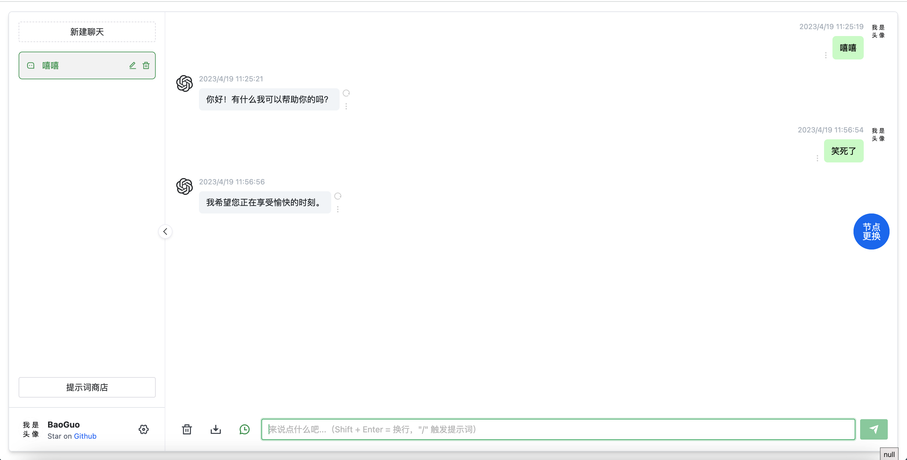
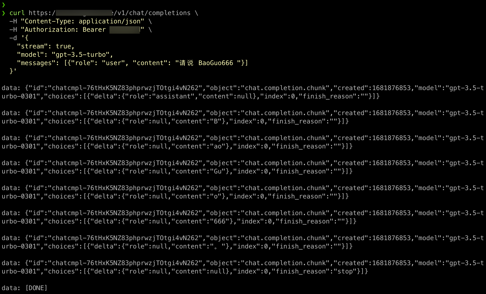
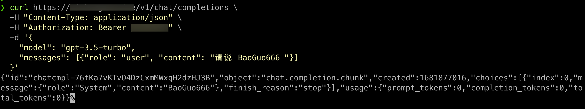
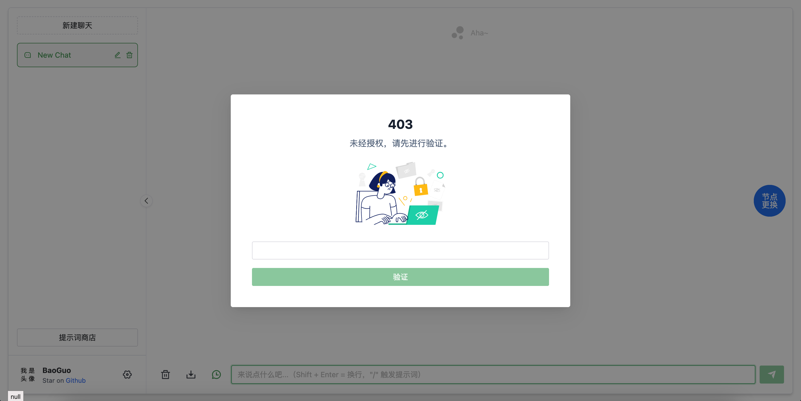
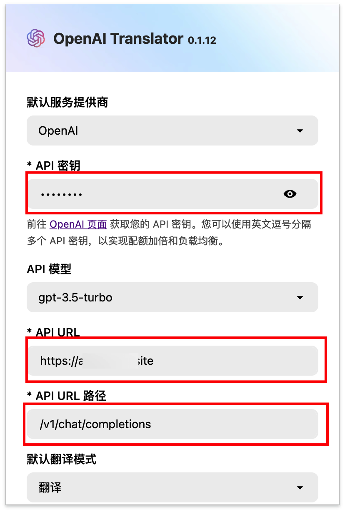
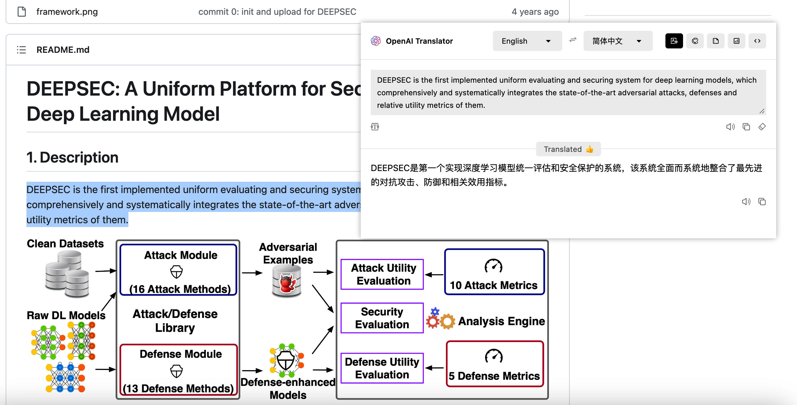
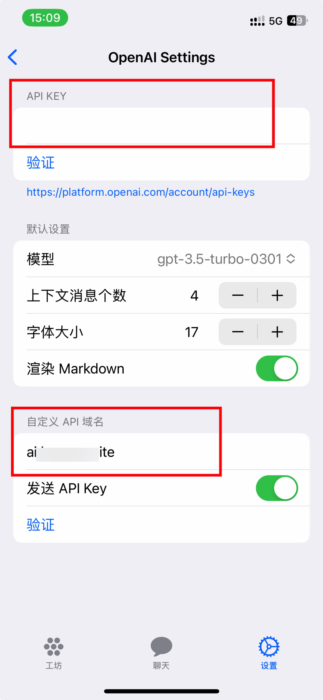

# chatgpt终极白嫖方案

## 介绍

> 使用GO实现的一个chatgpt反向代理服务器, 后端有几百个节点可供使用.
>
> 支持在配置文件中添加认证密钥. 必须配置密钥, 网页和api接口都需要使用.
>
> 基于ChatGpt-Web前端, 实现了网页版的聊天页面.
>
> 实现了和openai官网一样的chat聊天接口(仅支持聊天模式).

* 网页聊天模式



* api调用模式

1. 流式调用



2. 直接调用




## 安装方式

### 基础条件

* 一个可以联网的Linux/windows/macos电脑或者服务器

* 以下条件二选一
  * Fofa的api账户和key

  * 互联网上搜集的chatgpt-web网站的地址(要求未开启密码认证)，将搜集到的地址保存在url.txt中.

### 启动方式

* 如果使用二进制程序启动, 需要先安装redis依赖

> 需要先安装并启动redis数据库

> [Redis Download](https://redis.io/download/)

* 直接clone项目, 或者下载项目源码.

```shell
git clone https://github.com/ba0gu0/ChatGPT-Ultimate-Freeloading-Scheme.git
cd ChatGPT-Ultimate-Freeloading-Scheme
```

* Linux

```shell
# 先根据说明, 修改配置文件, 安装redis并启动
chmod +x bin/ChatGpt-Linux
./bin/ChatGpt-Linux -config config.yaml
```

* Windows

```cmd
# 先根据说明, 修改配置文件, 安装redis并启动
.\bin\ChatGpt-windows.exe -config config.yaml
```

* MacOS

```shell
# 先根据说明, 修改配置文件, 安装redis并启动
chmod +x bin/ChatGpt-Linux
./bin/ChatGpt-MacOS -config config.yaml
```

* Docker Compose

```shell
# 先根据说明, 修改配置文件, 不需要单独安装redis
chmod +x bin/ChatGpt-Linux
docker compose up -d
```

### 配置文件说明

#### ginServer

```yaml
# 开启网站和api接口的监听地址、监听端口、认证密钥
ginServer:
  host: "0.0.0.0"
# 如果修改这个端口，对应的docker-compose.yaml中映射的端口也需要修改
  port: "9060"
# 网页和api接口使用的认证密钥，可以写多个，使用yaml格式编写即可
  authkey:
    - "sk-**************1"
    - "sk-**************2"
```

#### redis

> redis的配置信息, 填写redis的连接地址、端口、密码

1. 直接二进制程序启动

```yaml
redis:
  host: "localhost"
  port: "6379"
  password:
```

2. 使用docker compose 启动

```yaml
# 如果使用的是docker compose文件启动的，需要将host修改为docker-compose.yaml中redis的容器名字
# 此处写的名字为当前项目docker-compose.yaml中redis的容器名字
redis:
  host: "redis"
  port: "6379"
  password:
```

#### domainList

> 提供一个或多个的url地址文件，文件中存放搜集到的chatgpt-web网站地址.
>
> 如果没有此文件, 则必须配置fofa账户. 也可以两者都配置.

1. 直接二进制程序启动

```yaml
domainList:
  filename:
    - "./url.txt"
    - "./url2.txt"
```

2. 使用docker compose 启动

```yaml
# 如果使用docker启动的服务，需要将对应的url文件映射到容器中
# 比如映射当前目录下的url.txt文件到容器内的/app/url.txt

# docker-compose.yaml配置
# volumes:
#   - ./url.txt:/app/url.txt

# config.yaml配置
# domainList:
#   filename:
#     - "/app/url.txt"

domainList:
  filename:
    - "/app/url.txt"
```

#### Fofa

> 配置fofa的email、key、搜索关键字、结果数量、定时抓取时间。
>
> 如果没有fofa的账户, 必须配置chatgpt-web网站文件. 也可以都配置.

```yaml
fofa:
  email: "*******@qq.com"
  key: "*************"
  query: "chatgpt-web"
  size: "10000"
# 指定定时更新fofa数据的间隔时间，单位是小时
  interval: 72
```

#### fofaCheck

> 配置fofa获取到的结果筛选规则, 线程数量、定时检查间隔、检查接口超时时间
>
> 一般不需要修改

```yaml
fofaCheck:
# 接口检测超时时间，单位秒
  timeout: 5
  thread: 50
# 指定定时清洗fofa数据的间隔时间，单位是小时
  interval: 12
```

#### chatGptCheck

> 配置数据库中存储的节点检测规则, 线程数量、定时检查间隔、检查接口超时时间
>
> 一般不需要修改

```yaml
chatGptCheck:
# 接口检测超时时间，单位秒
  timeout: 5
  thread: 50
# 指定定时检测chatgpt可用的间隔时间，单位是小时， 暂时未开启此功能。
  interval: 1
```

## 使用方式

* 直接浏览器访问平台, 认证密钥为`ginServer` ==> `authkey`中配置的密钥.




* 第三方浏览器插件`OpenAI Translator`使用api接口.

> 软件API密钥为项目配置文件中的`ginServer` ==> `authkey`中配置的密钥.
>
> 软件API URL为平台的可访问地址, 注意API URL中最后的`/`要去掉. 
>
> 软件API URL路径为默认即可, 也可以使用路径`/openai`.





* 第三方手机app `openCat`使用api接口.



